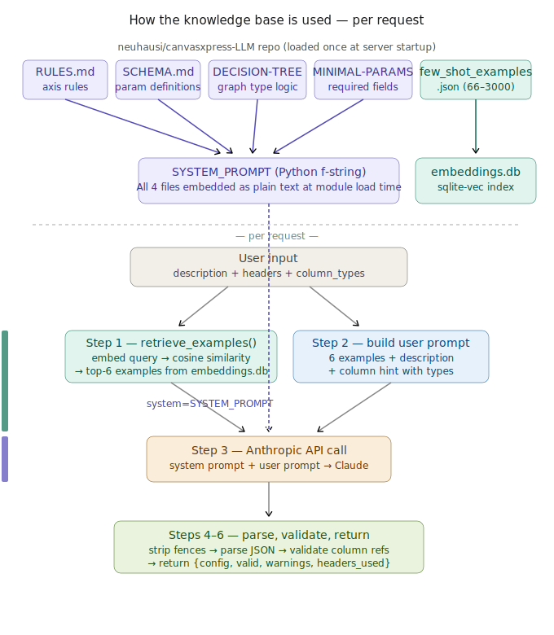

# CanvasXpress MCP Server

Natural language → CanvasXpress JSON configs, served over HTTP on port 8100.

Describe a chart in plain English. Get back a ready-to-use CanvasXpress JSON config
object ready to pass directly to `new CanvasXpress()`. No CanvasXpress expertise required.

```
"Clustered heatmap with RdBu colors and dendrograms on both axes"
"Volcano plot with log2 fold change on x-axis and -log10 p-value on y-axis"
"Violin plot of gene expression by cell type, Tableau colors"
"Survival curve for two treatment groups"
"PCA scatter plot colored by Treatment with regression ellipses"
```

Supports four LLM backends: **Anthropic API**, **Amazon Bedrock**, **Ollama** (local),
and **OpenAI-compatible** APIs including corporate gateways.

---

## How it works



1. Your description is matched against few-shot examples using **semantic vector search** (sqlite-vec)
2. The top 6 most relevant examples are included as context (RAG)
3. A **tiered system prompt** is assembled from the canvasxpress-LLM knowledge base — only the content relevant to your request is included
4. The configured LLM generates a validated CanvasXpress JSON config
5. If headers/data are provided, all column references are **validated** against them
6. The config is returned ready to pass to `new CanvasXpress()`

---

## Project structure

```
canvasxpress-mcp/
│
├── src/
│   ├── server.py           — FastMCP HTTP server (main entry point)
│   ├── llm_providers.py    — Unified LLM backend (Anthropic, Bedrock, Ollama, OpenAI)
│   ├── cx_knowledge.py     — Parameter knowledge skill (fetch, parse, validate, inject)
│   └── cx_survival.py      — Kaplan-Meier skill (generate, detect columns, validate, annotate)
│
├── data/
│   ├── few_shot_examples.json  — RAG examples (add more to improve accuracy)
│   └── embeddings.db           — sqlite-vec vector index (built by build_index.py)
│
├── build_index.py          — builds the vector index from few_shot_examples.json
│
├── test_client.py          — Python test client
├── test_client.pl          — Perl test client
├── test_client.mjs         — Node.js test client (Node 18+)
│
├── knowledge_base_flow.svg — architecture diagram
├── requirements.txt
└── README.md
```

---

## Setup

### 1. Python environment

```bash
python3.11 -m venv .venv
source .venv/bin/activate
pip install -r requirements.txt
```

### 2. Build the vector index (one-time)

Embeds the few-shot examples for semantic retrieval:

```bash
python build_index.py
```

Re-run whenever you add or change `data/few_shot_examples.json`. If you skip this
step the server still works — it falls back to text-similarity matching and logs a warning.

### 3. Configure your LLM provider

Choose one of the four supported providers and set the required environment variables.
See the [LLM providers](#llm-providers) section for full details.

```bash
# Quickstart — Anthropic (default)
export ANTHROPIC_API_KEY="sk-ant-..."
```

### 4. Start the server

```bash
python src/server.py
```

Server starts at: `http://localhost:8100/mcp`

**To run on a different port:**

```bash
MCP_PORT=9000 python src/server.py
```

Then point test clients at the new port:

```bash
MCP_URL=http://localhost:9000/mcp python test_client.py
MCP_URL=http://localhost:9000/mcp perl test_client.pl
MCP_URL=http://localhost:9000/mcp node test_client.mjs
```

### 5. Debug mode

See the full reasoning trace per request — provider, model, tier selection, retrieved
examples, prompt size, token usage, raw LLM response, and column validation:

```bash
CX_DEBUG=1 python src/server.py
```

Each request prints 6 labelled steps to stderr:

```
── STEP 1 — RETRIEVAL ──   query matched, 6 examples in 8ms
── STEP 2 — PROMPT ──      system 4821 chars, user 2103 chars
── TIERED PROMPT ──        Tier 2 (base+schema+data)  GraphType: Heatmap
── STEP 3 — LLM CALL ──    Provider: bedrock  Model: anthropic.claude-sonnet-...
                            Latency: 1243ms  Input: 3847 tokens  Output: 89 tokens
── STEP 4 — RAW RESPONSE   {"graphType": "Heatmap", ...}
── STEP 5 — PARSED CONFIG  graphType: Heatmap, keys: [...]
── STEP 6 — VALIDATION ──  ✅ All column references valid
```
---

**Running in the web**

There are two example clients

1. Automatically built when running:

```python
python src/build_index.py
```
It is a full Web page with a form to experiment, located at: `http://localhost:8100/ui`

2. To activate run
```python
python src/proxy_server.py
```
It is located at: `http://localhost:8200`

```bash
# Generate
GET /api/generate
  ?description=Clustered heatmap with RdBu colors   # required
  &headers=Gene,Sample1,Sample2,Treatment            # optional
  &column_types={"Gene":"string","Sample1":"numeric"} # optional JSON
  &data=[["Gene","S1"],["BRCA1",1.2]]                 # optional JSON (overrides headers)
  &temperature=0.0                                    # optional

# Modify
GET /api/modify
  ?config={"graphType":"Bar","xAxis":["Gene"]}       # required JSON
  &instruction=change colorScheme to Tableau         # required

# Kaplan-Meier
GET /api/km
  ?description=OS by treatment arm                   # at least one of these
  &headers=PatientID,OS_Time,OS_Status,Treatment     # optional
  &data=[["ID","Time","Event","Arm"],...]             # enables statistics
  &add_annotations=true

# Query parameters
GET /api/query_params
  ?graph_type=Heatmap         # list all params for a chart type
  &param_name=colorScheme     # get valid values for one param
  &refresh=true               # force re-fetch from GitHub
```

---

## LLM providers

The provider is selected via the `LLM_PROVIDER` environment variable. All provider
switching is handled in `src/llm_providers.py` — `server.py` is unchanged regardless
of which backend is active.

### Anthropic (default)

Direct access to the Anthropic API.

```bash
export LLM_PROVIDER=anthropic          # optional — this is the default
export ANTHROPIC_API_KEY="sk-ant-..."
export LLM_MODEL=claude-sonnet-4-20250514  # optional — this is the default
python src/server.py
```

No extra dependencies required beyond `requirements.txt`.

### Amazon Bedrock

Access Anthropic models through your AWS account via the Bedrock Converse API.
Uses your existing AWS credentials — IAM roles, SSO profiles, and temporary
credentials are all supported via the standard boto3 credential chain.

```bash
pip install boto3

export LLM_PROVIDER=bedrock
export AWS_REGION=us-east-1

# Option A — explicit credentials
export AWS_ACCESS_KEY_ID=...
export AWS_SECRET_ACCESS_KEY=...
export AWS_SESSION_TOKEN=...       # if using temporary credentials

# Option B — use an IAM role or SSO profile (no explicit keys needed)
# aws sso login --profile my-profile
# export AWS_PROFILE=my-profile

python src/server.py
```

**Available Bedrock model IDs:**

| Model | Bedrock model ID |
|-------|-----------------|
| Claude Sonnet 4.5 (default) | `anthropic.claude-sonnet-4-5-20251001-v1:0` |
| Claude Opus 4.5 | `anthropic.claude-opus-4-5-20251001-v1:0` |
| Claude Haiku 4.5 | `anthropic.claude-haiku-4-5-20251001-v1:0` |

```bash
# Override the model
export LLM_MODEL=anthropic.claude-opus-4-5-20251001-v1:0
```

### Ollama (local)

Run any model locally via [Ollama](https://ollama.com). No API keys, no network
dependency, no data leaves your machine.

```bash
# Install Ollama from https://ollama.com, then:
ollama serve                  # start the Ollama daemon
ollama pull llama3.2          # pull a model (one-time)

export LLM_PROVIDER=ollama
export LLM_MODEL=llama3.2     # or any model you have pulled
python src/server.py
```

`httpx` is already in `requirements.txt` so no extra install is needed.

**Custom Ollama host:**

```bash
export OLLAMA_BASE_URL=http://my-ollama-server:11434
```

**Other models to try:**

```bash
ollama pull mistral
ollama pull codellama
ollama pull gemma3
```

Note: smaller local models will generally produce less accurate CanvasXpress configs
than Claude. For best results use `llama3.2` (8B) or larger.

### OpenAI / corporate gateway

Any OpenAI-compatible API — including your company's internal gateway, Azure OpenAI,
or OpenAI directly. Set `OPENAI_BASE_URL` to point at your gateway instead of
`api.openai.com`.

```bash
pip install openai

export LLM_PROVIDER=openai
export OPENAI_API_KEY="your-gateway-token"
export OPENAI_BASE_URL="https://api.your-company.com/openai/v1"
export LLM_MODEL=gpt-4o
python src/server.py
```

**OpenAI directly:**

```bash
export LLM_PROVIDER=openai
export OPENAI_API_KEY="sk-..."
export LLM_MODEL=gpt-4o        # or o3, gpt-4o-mini, etc.
python src/server.py
```

**Azure OpenAI:**

```bash
export LLM_PROVIDER=openai
export OPENAI_API_KEY="your-azure-key"
export OPENAI_BASE_URL="https://YOUR-RESOURCE.openai.azure.com/openai/deployments/YOUR-DEPLOYMENT/v1"
export LLM_MODEL=gpt-4o
python src/server.py
```

**Optional organisation ID:**

```bash
export OPENAI_ORG="org-..."
```

---

## Configuration reference

### Core settings

| Env var | Default | Description |
|---------|---------|-------------|
| `MCP_HOST` | `0.0.0.0` | Bind host |
| `MCP_PORT` | `8100` | Port |
| `CX_DEBUG` | `0` | Set to `1` for full per-request debug trace |
| `EMBEDDING_MODEL` | `all-MiniLM-L6-v2` | Sentence-transformers model for the vector index |

### LLM provider settings

| Env var | Default | Description |
|---------|---------|-------------|
| `LLM_PROVIDER` | `anthropic` | Active provider: `anthropic`, `bedrock`, `ollama`, `openai` |
| `LLM_MODEL` | *(provider default)* | Model ID — overrides the provider default |

### Anthropic

| Env var | Default | Description |
|---------|---------|-------------|
| `ANTHROPIC_API_KEY` | — | **Required** |

### Amazon Bedrock

| Env var | Default | Description |
|---------|---------|-------------|
| `AWS_REGION` | `us-east-1` | AWS region where Bedrock is enabled |
| `AWS_ACCESS_KEY_ID` | — | Explicit key (or use IAM role / SSO) |
| `AWS_SECRET_ACCESS_KEY` | — | Explicit secret |
| `AWS_SESSION_TOKEN` | — | For temporary credentials |
| `AWS_PROFILE` | — | Named AWS profile |

### Ollama

| Env var | Default | Description |
|---------|---------|-------------|
| `OLLAMA_BASE_URL` | `http://localhost:11434` | Ollama server URL |

### OpenAI / gateway

| Env var | Default | Description |
|---------|---------|-------------|
| `OPENAI_API_KEY` | — | **Required** — your API key or gateway token |
| `OPENAI_BASE_URL` | `https://api.openai.com/v1` | Override for corporate gateways or Azure |
| `OPENAI_ORG` | — | Optional organisation ID |

---

## Knowledge base

All prompt content sourced from **[neuhausi/canvasxpress-LLM](https://github.com/neuhausi/canvasxpress-LLM)**,
organised into a tiered system that adds content only when needed:

| File | Tier | Triggered when | Content |
|------|------|----------------|---------|
| `RULES.md` | 1 | Always | Axis rules, decoration rules, sorting constraints |
| `DECISION-TREE.md` | 1 | Always | Graph type selection logic |
| `MINIMAL-PARAMETERS.md` | 1 | Always | Required parameters per graph type |
| `SCHEMA.md` | 2 | `headers` or `data` provided | Key parameter definitions |
| `CONTEXT.md` | 2 | `headers` or `data` provided | Data format guide (2D array vs y/x/z) |
| `CONTRADICTIONS.md` | 3 | 2+ chart-type keywords in description | Contradiction resolution strategies |

**Token cost per request:**

| Scenario | Tier | Input tokens |
|----------|------|-------------|
| `"clustered heatmap"` (no data) | 1 | ~5,000 |
| `"heatmap"` + headers | 2 | ~5,800 |
| `"scatter with regression"` + data | 3 | ~6,400 |

---

## Few-shot examples

The `data/few_shot_examples.json` file contains examples used for RAG retrieval.
Each example needs a `description` and a `config`:

```json
{
  "id": 67,
  "type": "Scatter2D",
  "description": "Scatter plot with loess smooth fit and confidence bands",
  "config": {
    "graphType": "Scatter2D",
    "xAxis": ["X"],
    "yAxis": ["Y"],
    "showLoessFit": true,
    "showConfidenceIntervals": true
  }
}
```

After adding examples, rebuild the index:

```bash
python build_index.py
```

The server scales to 3,000+ examples with no performance impact (~10ms retrieval).

---

## Test clients

All three clients accept the same arguments after the description, in any order:
- A **comma-separated string** → column headers
- A **JSON array of arrays** → data (first row = headers)
- A **JSON object** → column types (`string`/`numeric`/`factor`/`date`)

### Python

```bash
# Default — built-in sample data + types
python test_client.py

# Headers only
python test_client.py "Violin plot by cell type" "Gene,CellType,Expression"

# Headers + column types
python test_client.py "Scatter plot" "Gene,Expr,Treatment" \
  '{"Gene":"string","Expr":"numeric","Treatment":"factor"}'

# Full data array + types
python test_client.py "Heatmap" \
  '[["Gene","S1","S2","Treatment"],["BRCA1",1.2,3.4,"Control"]]' \
  '{"Gene":"string","S1":"numeric","S2":"numeric","Treatment":"factor"}'
```

### Perl

```bash
# requires: cpan LWP::UserAgent JSON
perl test_client.pl
perl test_client.pl "Volcano plot" "Gene,log2FC,pValue"
perl test_client.pl "Scatter plot" "Gene,Expr,Treatment" \
  '{"Gene":"string","Expr":"numeric","Treatment":"factor"}'
```

### Node.js

```bash
# requires: Node 18+  and  npm install @modelcontextprotocol/sdk
node test_client.mjs
node test_client.mjs "Scatter plot by Treatment" "Gene,Sample1,Treatment"
node test_client.mjs "Heatmap" \
  '[["Gene","S1","Treatment"],["BRCA1",1.2,"Control"]]' \
  '{"Gene":"string","S1":"numeric","Treatment":"factor"}'
```

---

## Response format

```json
{
  "config": {
    "graphType": "Heatmap",
    "xAxis": ["Gene"],
    "samplesClustered": true,
    "variablesClustered": true,
    "colorScheme": "RdBu",
    "heatmapIndicator": true
  },
  "valid": true,
  "warnings": [],
  "invalid_refs": {},
  "headers_used": ["Gene", "Sample1", "Sample2", "Treatment"],
  "types_used": {"Gene": "string", "Sample1": "numeric", "Treatment": "factor"}
}
```

| Field | Description |
|-------|-------------|
| `config` | CanvasXpress JSON config — pass directly to `new CanvasXpress()` |
| `valid` | `true` if all column references exist in the provided columns |
| `warnings` | Column validation warnings (empty if valid) |
| `invalid_refs` | Map of config key → missing column names |
| `headers_used` | Column names used for validation |
| `types_used` | Column types passed in (if provided) |

---

## MCP tools

| Tool | Description |
|------|-------------|
| `generate_canvasxpress_config` | Plain English + optional data/headers/types → validated JSON config |
| `modify_canvasxpress_config` | Modify an existing config using a plain English instruction |
| `generate_km_config` | Generate, validate, and annotate Kaplan-Meier survival plot configs |
| `query_canvasxpress_params` | Look up parameters, valid values, and descriptions from the live schema |
| `list_chart_types` | All 70+ chart types organised by category |
| `explain_config_property` | Explains any CanvasXpress config property |
| `get_minimal_parameters` | Required parameters for a given graph type |

### `generate_canvasxpress_config` arguments

| Argument | Type | Required | Description |
|----------|------|----------|-------------|
| `description` | string | ✅ | Plain English chart description |
| `headers` | string[] | ❌ | Column names from your dataset |
| `data` | array[][] | ❌ | CSV-style data array — first row = headers. Overrides `headers` |
| `column_types` | object | ❌ | Map of column → type (`string`/`numeric`/`factor`/`date`) |
| `temperature` | float | ❌ | LLM creativity 0–1 (default 0.0) |

---

### `generate_km_config`

A dedicated skill for Kaplan-Meier survival plots. Accepts any combination of a plain
English description, column headers, a full data array, or an existing config — and
handles all four capabilities automatically based on what you provide.

**Arguments:**

| Argument | Type | Required | Description |
|----------|------|----------|-------------|
| `description` | string | ❌ | Plain English description of the KM plot |
| `headers` | string[] | ❌ | Column names from your dataset |
| `data` | array[][] | ❌ | Full data array — first row = headers. Enables statistics + decorations |
| `config` | object | ❌ | Existing KM config to validate, fix, and enrich |
| `add_annotations` | boolean | ❌ | Compute and embed median survival + log-rank p-value (default `true`) |
| `temperature` | float | ❌ | LLM creativity 0–1 (default 0.0) |

At least one of `description`, `headers`, `data`, or `config` must be provided.

**Response:**

```json
{
  "config": {
    "graphType": "KaplanMeier",
    "xAxis": ["OS_Time"],
    "yAxis": ["OS_Status"],
    "groupingFactors": ["Treatment"],
    "xAxisTitle": "Time (months)",
    "yAxisTitle": "Survival Probability",
    "colorScheme": "Tableau",
    "showLegend": true,
    "decorations": [
      { "type": "line",  "value": 14.2, "color": "#1f77b4", "label": "Median Control: 14.2 months" },
      { "type": "line",  "value": 22.8, "color": "#ff7f0e", "label": "Median Drug A: 22.8 months" },
      { "type": "text",  "value": 0,    "color": "#333333", "label": "Log-rank p = 0.031" }
    ]
  },
  "valid": true,
  "errors": [],
  "warnings": [],
  "suggestions": [],
  "column_detection": {
    "time_col":   "OS_Time",
    "event_col":  "OS_Status",
    "group_cols": ["Treatment"],
    "unassigned": ["PatientID"],
    "confidence": "high",
    "notes": []
  },
  "statistics": {
    "groups": {
      "Control": { "n": 45, "n_events": 38, "median_survival": 14.2 },
      "Drug A":  { "n": 48, "n_events": 31, "median_survival": 22.8 }
    },
    "logrank_pvalue": 0.031,
    "pvalue_str": "p = 0.031"
  },
  "decorations_added": true
}
```

**What each capability does:**

**1. Column detection** — runs on every call when headers or data are provided.
Uses pattern matching against common survival analysis naming conventions
(`OS_Time`, `PFS_Status`, `days`, `event`, `treatment`, `arm`, etc.).
Reports confidence level (`high` / `medium` / `low`) and notes for any
columns it couldn't assign.

**2. Config generation** — calls the LLM with a KM-specific system prompt that
enforces the strict `graphType: "KaplanMeier"` rules, correct axis assignments,
and appropriate defaults (`colorScheme: "Tableau"`, `showLegend: true`).
Column roles from detection are injected directly into the prompt.

**3. Config validation** — checks any provided or generated config against KM
rules: `graphType` must be `"KaplanMeier"`, `xAxis` must hold the time column,
`yAxis` must hold the event column, no forbidden single-dimensional params.
Returns `errors` (must-fix), `warnings` (should-fix), and `suggestions`
(nice-to-have), plus an auto-corrected `fixed_config`.

**4. Statistical annotations** — when `data` is provided, computes per-group
KM curves (pure Python, no scipy needed), extracts median survival times,
and runs a log-rank test for two-group comparisons. Results are embedded
as `decorations` in the config: vertical lines at each group's median
survival time, and a text annotation with the log-rank p-value.

**Usage examples:**

```python
# From description alone
generate_km_config(
    description="Overall survival by treatment arm"
)

# From headers — detects columns, generates config
generate_km_config(
    description="PFS curve colored by disease stage",
    headers=["PatientID", "PFS_Time", "PFS_Status", "Stage"]
)

# From full data — generates config + computes statistics + adds decorations
generate_km_config(
    data=[
        ["PatientID", "Time", "Event", "Treatment"],
        ["P001", 24, 1, "Control"],
        ["P002", 18, 0, "Drug A"],
        ...
    ]
)

# Validate an existing config
generate_km_config(
    config={"graphType": "KaplanMeier", "xAxis": ["Time"]},
    headers=["PatientID", "Time", "Event", "Treatment"]
)
```


---

### `query_canvasxpress_params`

Query the CanvasXpress parameter knowledge base — fetched live from the
[canvasxpress-LLM](https://github.com/neuhausi/canvasxpress-LLM) GitHub repo
with automatic local cache fallback.

**Arguments:**

| Argument | Type | Required | Description |
|----------|------|----------|-------------|
| `graph_type` | string | ❌ | Chart type e.g. `"Heatmap"`, `"Scatter2D"` — returns all parameters for this type |
| `param_name` | string | ❌ | Parameter name e.g. `"colorScheme"`, `"areaType"` — returns full definition |
| `refresh` | boolean | ❌ | Force re-fetch from GitHub even if cache is fresh (default `false`) |

Pass `graph_type` alone, `param_name` alone, both together, or neither for a full summary.

**Example responses:**

```json
// query_canvasxpress_params(param_name="areaType")
{
  "found": true,
  "param": "areaType",
  "description": "How area series are drawn. REQUIRED for Area charts.",
  "type": "string",
  "valid_values": ["overlapping", "stacked", "percent"],
  "graph_types": ["Area", "AreaLine"],
  "schema_source": "GitHub"
}

// query_canvasxpress_params(graph_type="Heatmap")
{
  "graph_type": "Heatmap",
  "param_count": 12,
  "params": {
    "colorScheme":        { "type": "string",  "valid_values": ["RdBu", "Spectral", ...] },
    "samplesClustered":   { "type": "boolean", "valid_values": [] },
    "variablesClustered": { "type": "boolean", "valid_values": [] },
    "heatmapIndicator":   { "type": "boolean", "valid_values": [] },
    "smpOverlays":        { "type": "string",  "valid_values": [] },
    ...
  },
  "schema_source": "cache"
}
```

**What the skill does internally:**

The skill powers three things at once, automatically — you don't need to call the tool for these to be active:

1. **Prompt injection** — on every `generate_canvasxpress_config` or `modify_canvasxpress_config` call, a live snippet of valid parameter values for the detected graph type is appended to the system prompt. This tightens generation — the model knows `areaType` can only be `"overlapping"`, `"stacked"`, or `"percent"`, not some invented value.

2. **Value validation** — after generation, every string-valued config parameter is checked against its known valid values. Invalid values (e.g. `colorScheme: "BluRed"`) appear as warnings in the response alongside the existing column-reference warnings.

3. **MCP tool** — the `query_canvasxpress_params` tool lets you interrogate the schema directly: what params does a Heatmap support? What are the valid values for `lineType`?

**Configuration:**

| Env var | Default | Description |
|---------|---------|-------------|
| `CX_SCHEMA_TTL` | `3600` | Schema cache TTL in seconds |
| `CX_SKIP_FETCH` | `0` | Set to `1` to always use cache / bundled schema (no GitHub fetch) |


---

### `modify_canvasxpress_config`

Pass an existing config and a plain English instruction describing what to change.
The full config is preserved except for the modifications you request.

**Arguments:**

| Argument | Type | Required | Description |
|----------|------|----------|-------------|
| `config` | object | ✅ | The existing CanvasXpress JSON config to modify |
| `instruction` | string | ✅ | Plain English description of the change to apply |
| `headers` | string[] | ❌ | Column names — used to validate any new column references |
| `data` | array[][] | ❌ | CSV-style data array — first row = headers. Overrides `headers` |
| `column_types` | object | ❌ | Map of column → type (`string`/`numeric`/`factor`/`date`) |
| `temperature` | float | ❌ | LLM creativity 0–1 (default 0.0) |

**Response** includes all the same fields as `generate_canvasxpress_config`, plus a `changes` field:

```json
{
  "config":       { "graphType": "Heatmap", "title": "My Heatmap", "colorScheme": "Tableau", ... },
  "valid":        true,
  "warnings":     [],
  "invalid_refs": {},
  "headers_used": [],
  "types_used":   {},
  "changes": {
    "added":   ["title"],
    "removed": [],
    "changed": ["colorScheme"]
  }
}
```

**Example instructions:**

```
"add a title My Heatmap"
"change the color scheme to Tableau"
"remove the legend"
"set the x-axis title to Fold Change"
"switch to dark theme"
"add groupingFactors for the Treatment column"
"enable hierarchical clustering on both axes"
"set y-axis min to 0 and max to 100"
"add a horizontal reference line at y = 1.5"
"change graphType from Bar to Lollipop"
"remove the colorScheme and theme parameters"
```

**Usage example:**

```python
# Start with a generated config
result = generate_canvasxpress_config(
    description="clustered heatmap of gene expression",
    headers=["Gene", "S1", "S2", "S3", "Treatment"],
)
config = result["config"]
# {"graphType": "Heatmap", "xAxis": ["Gene"], "samplesClustered": true, ...}

# Now modify it
modified = modify_canvasxpress_config(
    config=config,
    instruction="change the color scheme to Spectral and add a title Expression Heatmap",
)
# modified["config"] = {"graphType": "Heatmap", "xAxis": ["Gene"],
#                       "samplesClustered": true, "colorScheme": "Spectral",
#                       "title": "Expression Heatmap", ...}
# modified["changes"] = {"added": ["title"], "removed": [], "changed": ["colorScheme"]}
```
